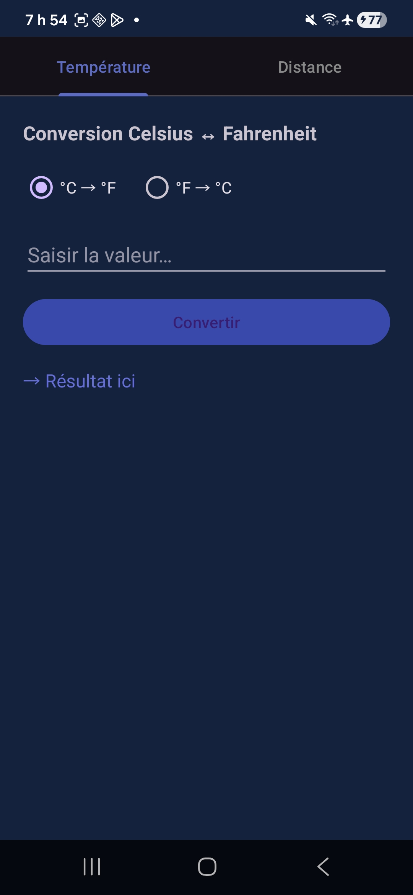
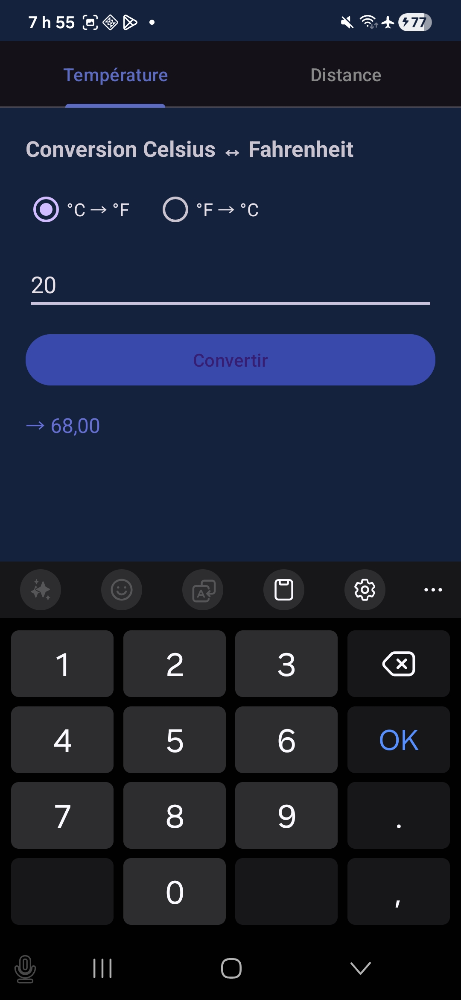
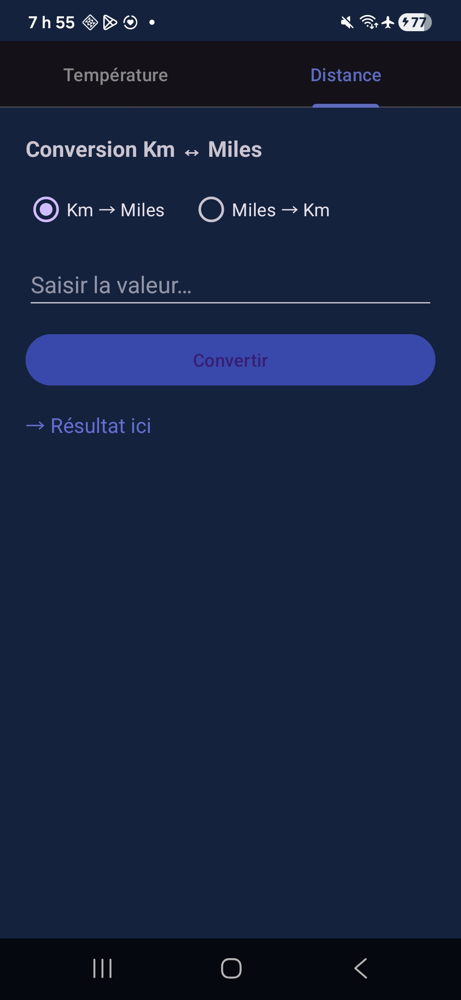
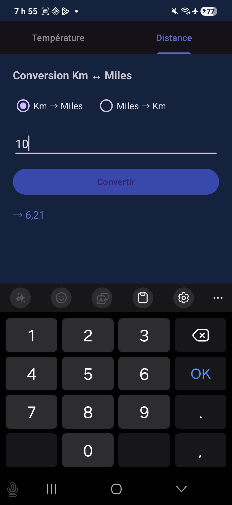

# ConvertisseurUnites — LAB 5

Application Android développée dans le cadre du cours de **Programmation Mobile (Android avec Java)**.

## Fonctionnalités

- Conversion **Celsius ↔ Fahrenheit**
- Conversion **Kilomètres ↔ Miles**
- Navigation par onglets (TabLayout + ViewPager2)
- Confirmation avant fermeture (AlertDialog)

## Captures d'écran

### Onglet Température

### Onglet Distance

## Technologies utilisées

- Java
- Android SDK — API 24+
- Material Design 3 (TabLayout, AlertDialog)
- ViewPager2 + FragmentStateAdapter
